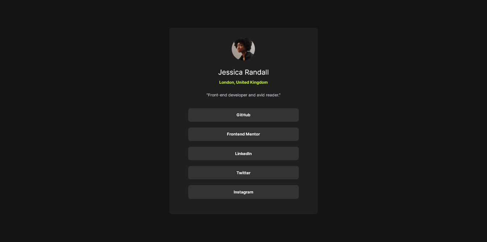
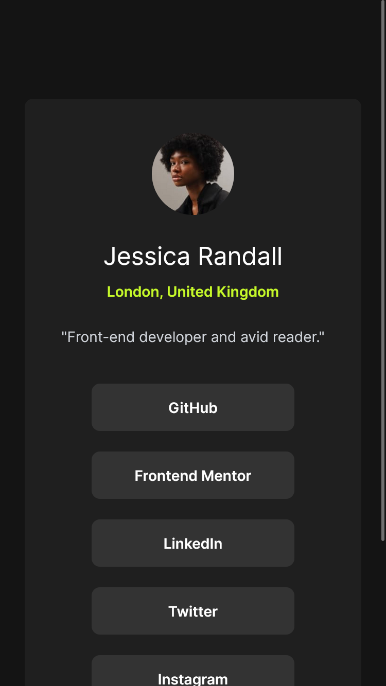

# Frontend Mentor - Social links profile solution

This is a solution to the [Social links profile challenge on Frontend Mentor](https://www.frontendmentor.io/challenges/social-links-profile-UG32l9m6dQ). Frontend Mentor challenges help you improve your coding skills by building realistic projects. 

## Table of contents

- [Overview](#overview)
  - [The challenge](#the-challenge)
  - [Screenshot](#screenshot)
  - [Links](#links)
- [My process](#my-process)
  - [Built with](#built-with)
  - [What I learned](#what-i-learned)
  - [Continued development](#continued-development)
  - [Useful resources](#useful-resources)
- [Author](#author)
- [Acknowledgments](#acknowledgments)

## Overview

This is my 1st project in FrontEnd Mentor using HTML & Tailwind.

### The challenge

Users should be able to:

- See hover and focus states for all interactive elements on the page

### Links

- Solution URL: [Add solution URL here](https://www.frontendmentor.io/solutions/responsive-social-links-using-css-grid-zG8jOPkoUQ)
- Live Site URL: [Add live site URL here](https://sleepypillowz-social-links.netlify.app/)

### Screenshot

## My process

  1. Before taking on the challenge, I established my foundational knowledge in Tailwind.
  2. I began coding the semantics for HTML, focusing on structuring the document.
  3. I implemented tailwind commenting some html so I can focus on designing one html at a time.
  4. The design process involved implementing familiar Tailwind classes and referring to the documentation for unfamiliar ones.
  5. When opportunities arose to reduce code, such as in default styles for the body and btn class, I took advantage of them.
  6. Later in the process, I discovered a style guide and incorporated its principles to ensure consistency and best practices in my design.

### Built with

- Semantic HTML5 markup
- CSS custom properties
- CSS Grid
- Mobile-first workflow
- [Tailwind](https://tailwindcss.com/) - CSS framework

### What I learned

- The proper usage of divs and main to seperate related elements and style them much more conviently using tailwind.

- The customization in tailwind.config.js for specific colors and font family.

- The centering of the main content using grid columns.

- The benefits of using mobile first approach.

- The process of working with a given template and a set of standards to follow.

- Making an image round using a container.

### Continued development

I'd like to continue using the tailwind framework as there's much I've yet to try.

### Useful resources

- [Tailwind CSS Tutorial](https://www.youtube.com/watch?v=bxmDnn7lrnk&list=PL4cUxeGkcC9gpXORlEHjc5bgnIi5HEGhw) - This playlist allowed me to build my fundamentals in Tailwind.

- [Tailwind](https://tailwindcss.com/) - This helped me refer to unfamiliar concepts and resources I may be able to use.

## Author

- Website - [alexacojido](https://alexacojido.netlify.app/)
- Frontend Mentor - [@sleepypillowz](https://www.frontendmentor.io/profile/sleepypillowz)
- Github - [sleepypillowz](https://github.com/sleepypillowz)

## Acknowledgments

Big thanks to Net Ninja for helping me build my fundamentals in tailwind, The tailwind team itself for a good framework and documentation of their work and frontend mentor for giving me an structured way of building websites.
